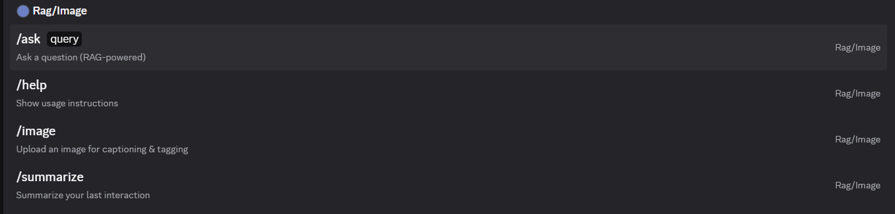
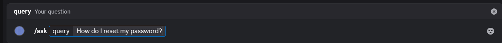
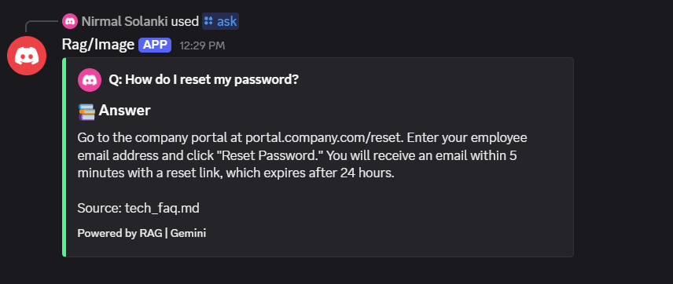
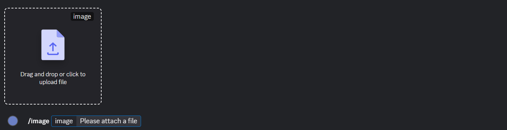
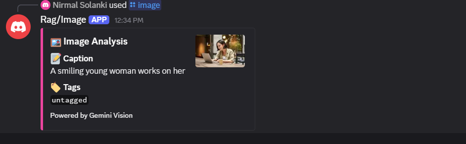
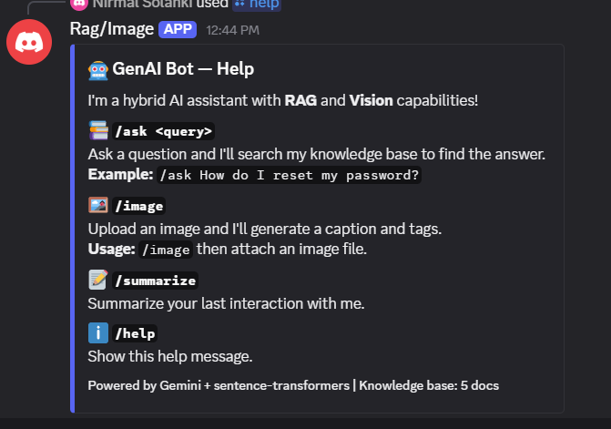
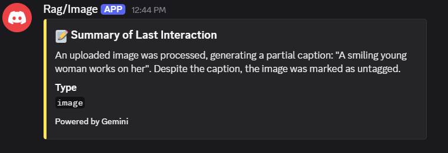

# 🤖 GenAI Discord Bot — Hybrid RAG + Vision Assistant

A lightweight, modular Discord bot that combines **Retrieval-Augmented Generation (RAG)** for knowledge-base Q&A with **Vision capabilities** for image captioning and tagging — powered by Google Gemini and sentence-transformers.

---

## ✨ Features

| Feature | Description |
|---------|-------------|
| 📚 **RAG Q&A** (`/ask`) | Ask questions answered from a local knowledge base of Markdown documents |
| 🖼️ **Image Analysis** (`/image`) | Upload an image and get a caption + 3 keyword tags |
| 📝 **Summarize** (`/summarize`) | Summarize your last interaction |
| 💬 **Conversation History** | Maintains last 3 interactions per user for context-aware responses |
| ⚡ **Query Caching** | LRU cache avoids re-embedding identical queries |
| 📄 **Source Citations** | RAG responses include source document names and relevance scores |

---

## 📸 Demo Screenshots

### Bot Slash Commands

All four commands available at a glance — `/ask`, `/help`, `/image`, and `/summarize`:



---

### 📚 RAG Q&A — `/ask` Demo

**Step 1:** Type `/ask` and enter your question:



**Step 2:** The bot retrieves relevant chunks from the knowledge base and responds with an answer + source citation:



---

### 🖼️ Image Analysis — `/image` Demo

**Step 1:** Type `/image` and drag & drop (or click to upload) your image:



**Test image used:**


**Step 2:** The bot analyses the image and returns a caption + tags:



---

### ℹ️ Help — `/help` Demo

The `/help` command shows a detailed guide with all available commands, descriptions, and usage examples:



---

### 📝 Summarize — `/summarize` Demo

The `/summarize` command provides a concise summary of your last interaction (text or image):



---

## 🏗️ Architecture

```
┌─────────────┐     ┌──────────────────────────────────────────────────────┐
│ Discord User │────▶│  Discord Bot (discord.py)                           │
└─────────────┘     │  ┌─────────┬──────────┬──────────┬───────────────┐  │
                    │  │  /ask   │  /image  │  /help   │  /summarize   │  │
                    │  └────┬────┴─────┬────┴──────────┴───────┬───────┘  │
                    └───────┼──────────┼───────────────────────┼──────────┘
                            │          │                       │
                    ┌───────▼──────┐  ┌▼──────────────┐  ┌────▼─────────┐
                    │ RAG Pipeline │  │ Vision Handler │  │ LLM Summarize│
                    │              │  │                │  │              │
                    │ 1. Embed     │  │ 1. Download    │  │ Gemini API   │
                    │ 2. Search    │  │ 2. Validate    │  └──────────────┘
                    │ 3. Context   │  │ 3. Gemini API  │
                    │ 4. Generate  │  │ 4. Parse       │
                    └──┬───────────┘  └────────────────┘
                       │
          ┌────────────┼────────────────┐
          │            │                │
  ┌───────▼──────┐ ┌──▼────────┐ ┌─────▼──────┐
  │ Embedder     │ │ Vector    │ │ LLM        │
  │ MiniLM-L6-v2│ │ Store     │ │ Generator  │
  │ (local)     │ │ (SQLite)  │ │ (Gemini)   │
  └──────────────┘ └───────────┘ └────────────┘
```

---

## 🚀 Quick Start

### Prerequisites

- **Python 3.11+**
- **Discord Bot Token** — [Create one here](https://discord.com/developers/applications) 
- **Google Gemini API Key** — [Get one here](https://aistudio.google.com/apikey)

### 1. Clone & Install

```bash
git clone <repo-url>
cd DiscordBotRAG

# Create virtual environment
python -m venv .venv
.venv\Scripts\activate        # Windows
# source .venv/bin/activate   # Linux/Mac

# Install dependencies
pip install -r requirements.txt
```

### 2. Configure

```bash
# Copy the example env file
copy .env.example .env        # Windows
# cp .env.example .env        # Linux/Mac

# Edit .env and add your tokens:
# DISCORD_TOKEN=your-discord-bot-token
# GEMINI_API_KEY=your-gemini-api-key
```

### 3. Set Up Discord Bot

1. Go to [Discord Developer Portal](https://discord.com/developers/applications)
2. Click **New Application** → give it a name
3. Go to **Bot** → click **Reset Token** → copy the token to `.env`
4. Enable these **Privileged Gateway Intents**:
   - ✅ Message Content Intent
5. Go to **OAuth2** → **URL Generator**:
   - Scopes: `bot`, `applications.commands`
   - Bot Permissions: `Send Messages`, `Embed Links`, `Attach Files`, `Read Message History`
6. Copy the generated URL and invite the bot to your server

### 4. Run

```bash
python app.py
```

The bot will:
1. Load the embedding model (~80 MB on first run)
2. Index all documents in `knowledge_base/`
3. Sync slash commands with Discord
4. Go online and listen for commands

---

## 🐳 Docker Deployment

```bash
# Build and run with Docker Compose
docker compose up -d

# View logs
docker compose logs -f bot

# Stop
docker compose down
```

---

## 📁 Project Structure

```
DiscordBotRAG/
├── app.py                    # Entry point
├── config.py                 # Configuration & env vars
├── requirements.txt          # Python dependencies
├── Dockerfile                # Container setup
├── docker-compose.yml        # One-command deployment
├── .env.example              # Environment template
├── .gitignore
│
├── bot/                      # Discord bot layer
│   ├── client.py             # Bot client setup & lifecycle
│   └── commands.py           # Slash command handlers
│
├── rag/                      # RAG pipeline
│   ├── chunker.py            # Document → overlapping chunks
│   ├── embedder.py           # sentence-transformers wrapper
│   ├── vector_store.py       # SQLite vector storage + search
│   └── retriever.py          # Orchestrates embed → search → generate
│
├── vision/                   # Image analysis
│   └── handler.py            # Gemini Vision captioning + tagging
│
├── llm/                      # Language model
│   └── generator.py          # Gemini API wrapper
│
├── utils/                    # Shared utilities
│   ├── cache.py              # LRU query & response cache
│   └── history.py            # Per-user interaction history
│
└── knowledge_base/           # RAG documents
    ├── company_policies.md
    ├── tech_faq.md
    ├── python_tips.md
    ├── ai_glossary.md
    └── remote_work_guide.md
```

---

## 🤖 Commands

| Command | Description | Example |
|---------|-------------|---------|
| `/ask <query>` | Search knowledge base and answer | `/ask How do I reset my password?` |
| `/image <attachment>` | Analyse an uploaded image | `/image` + attach a photo |
| `/summarize` | Summarize your last interaction | `/summarize` |
| `/help` | Show all available commands | `/help` |

---

## 🧠 Models & APIs Used

| Component | Model | Why |
|-----------|-------|-----|
| **Embeddings** | `all-MiniLM-L6-v2` (local) | ~80 MB, fast, high-quality semantic embeddings |
| **LLM** | Gemini 2.0 Flash (API) | Free tier, fast, strong reasoning |
| **Vision** | Gemini 2.0 Flash (API) | Built-in multimodal — no extra model needed |

### Why Gemini over local LLMs?
- **Zero GPU requirement** — runs on any machine
- **Free API tier** — 15 RPM, 1M tokens/day
- **Multimodal built-in** — same API for text and vision
- **Fast response times** — <2 seconds typical

### Why all-MiniLM-L6-v2 for embeddings?
- **Runs locally** — no API calls for embedding
- **Small footprint** — 80 MB model, 384-dim vectors
- **Excellent quality** — top performer on MTEB benchmarks for its size

---

## ⚙️ Configuration

All settings are configurable via `.env`:

| Variable | Default | Description |
|----------|---------|-------------|
| `DISCORD_TOKEN` | — | Discord bot token (required) |
| `GEMINI_API_KEY` | — | Google Gemini API key (required) |
| `GEMINI_MODEL` | `gemini-2.0-flash` | Model for text generation |
| `GEMINI_VISION_MODEL` | `gemini-2.0-flash` | Model for image analysis |
| `EMBEDDING_MODEL` | `all-MiniLM-L6-v2` | Sentence-transformers model |
| `CHUNK_SIZE` | `500` | Max characters per document chunk |
| `CHUNK_OVERLAP` | `50` | Character overlap between chunks |
| `TOP_K` | `3` | Number of chunks to retrieve |
| `MAX_HISTORY` | `3` | Interactions to keep per user |
| `CACHE_MAX_SIZE` | `128` | Max entries in LRU cache |

---

## 📚 Adding Knowledge Base Documents

Simply add `.md` or `.txt` files to the `knowledge_base/` directory and restart the bot. The chunker will automatically:

1. Split documents into ~500-character chunks with 50-char overlap
2. Embed each chunk using the local model
3. Store vectors in SQLite for fast retrieval

**Tips:**
- Use headings (`##`) to create natural chunk boundaries
- Keep paragraphs focused on one topic for better retrieval
- Delete `vector_store.db` to force re-indexing after changes

---

## 🔒 Security Notes

- Never commit your `.env` file (it's in `.gitignore`)
- The bot only reads images temporarily — nothing is stored
- SQLite DB contains only document chunks and their embeddings
- No user data is persisted between bot restarts (history is in-memory)

---

## 📄 License

MIT License — feel free to use and modify.
